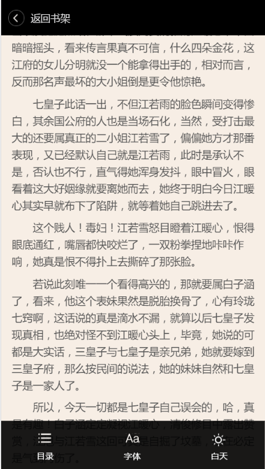
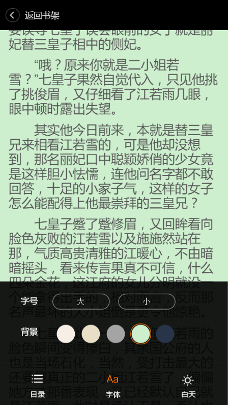

---
#webappbook
-------------

移动APP阅读器前端

###主要功能：

1.翻页功能 （ajax实现与后台的数据交互）
2.字体、颜色的切换

####示例:

 
 
 

 
 
###使用工具

1.lib/zepto.min.js 

2.js/jquery.base64.js base64解析

3.js/jquery.jsonp.js jsonp使用

###使用方法

为实现跨域数据传输，请右键点击浏览器的快捷方式，选择属性—目标，添加--allow-file-access-from-files

###注意事项

由于功能较简单，js，css都未抽离

